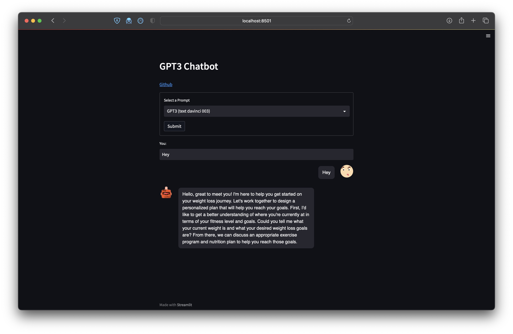
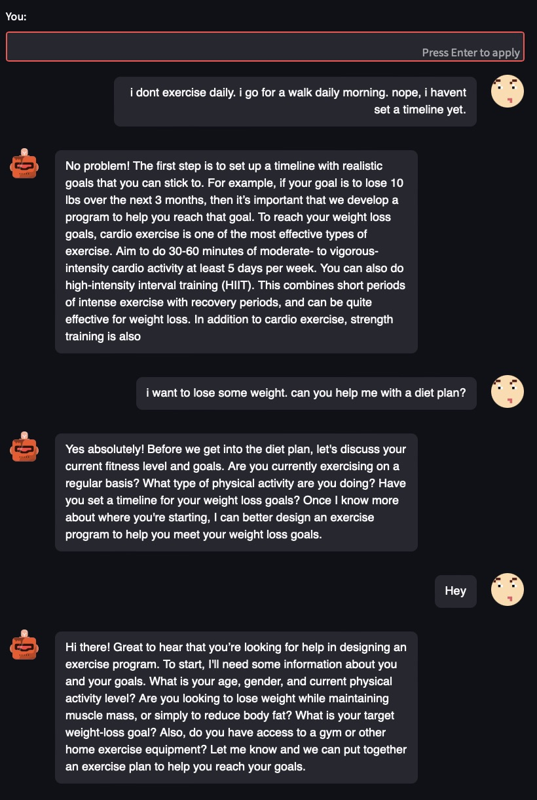

Fitness Coach Chatbot with ChatGPT
================================

This project aims to create a chatbot using ChatGPT(GPT-3.5-turbo)/ GPT3 (text-davinci-003) API that can help users with their fitness goals like being their personal fitness trainer. The chatbot can provide suggestions related to exercise routines, diet plans, and more based on the users' fitness goals.

Prerequisites
-------------

Before getting started with the project, you will need to have an OpenAI API key. You can get the key by signing up on the [OpenAI's website](https://platform.openai.com/account/api-keys). Once you have an API key, you can integrate it with the Streamlit interface.

Integration
-----------

* Install the requirements by:
```sh
pip install requirements.txt
```

* Once all the requirement libraries are installed, create a file called `apikey.py`

* Declare a varibale named `openai_api_key` with API key value.
```sh
echo "openai_api_key = '<Enter your OpenAI Key here>' " > apikey.py
```

Running the Streamlit App
-------------------------

Run the Streamlit app using the following command:

```sh
streamlit run chatbot.py
```

The app should now be running on your localhost.

```sh
localhost:8501
```

Demo Screenshots
----------------

Here are some screenshots of the chatbot in action:





